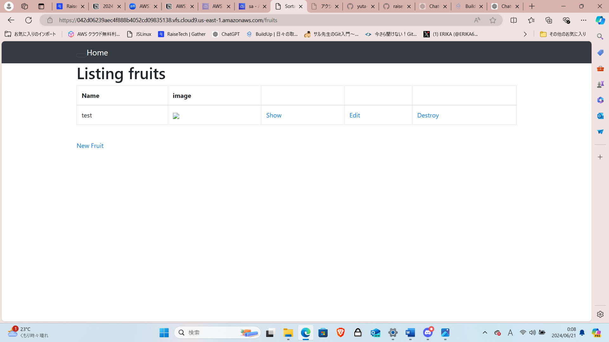
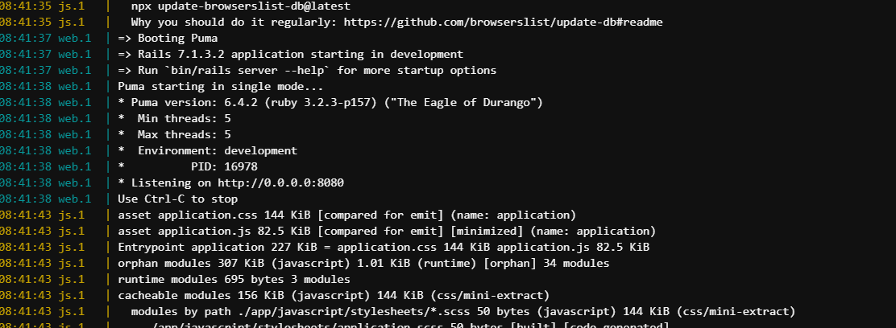
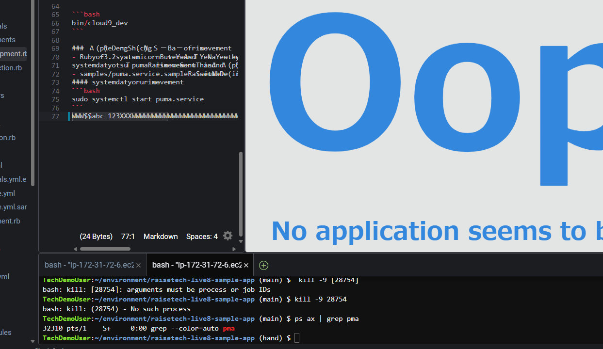
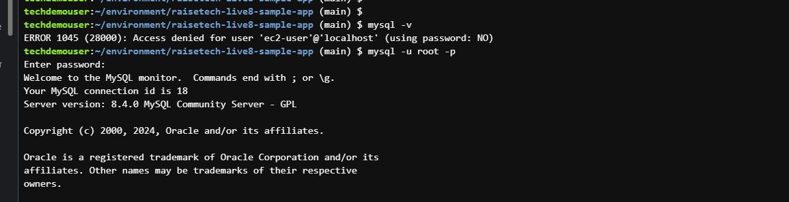
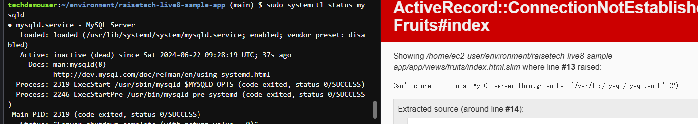

# 第三回の講義を聞いて

1. サンプルアプリがブラウザで起動できました。  

  

2. APサーバーについて。  
 - 名前とバージョン。停止させたらブラウザ起動できなかった。  
 
  
  

3. DBサーバーについて。  

- 名前とバージョン。停止させたら起動できなかった。  
- rails:構成管理ツール：Bundler  

  
  

4. 感想  
サンプルをブラウザで起動させるのがすごく大変だった。時間もかかったし、途中で操作が効かなくなって、何度も作り直しました。  
言語があればさくさく動くものだと思っていました。しかし、詰め合わせがあって、それぞれが一緒じゃないと操作ができないという複雑なものだと知りました。
