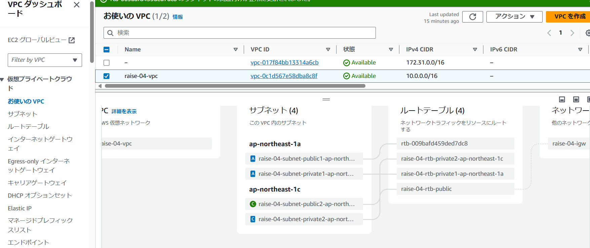
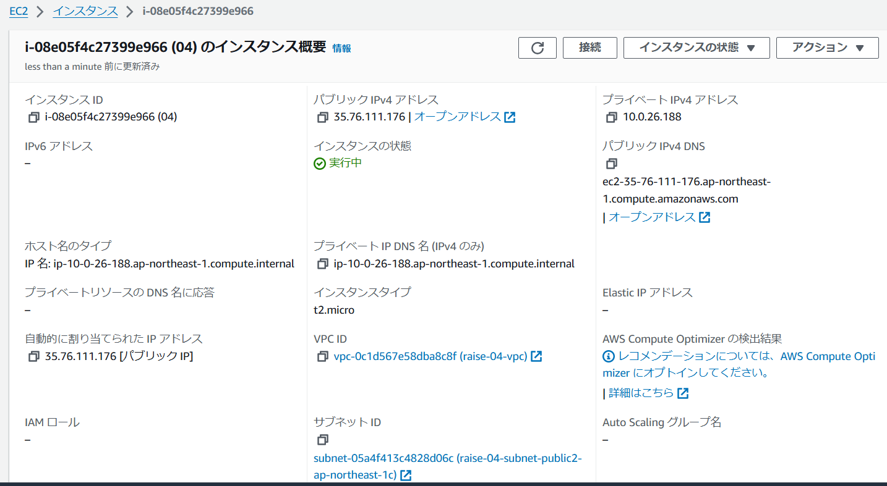
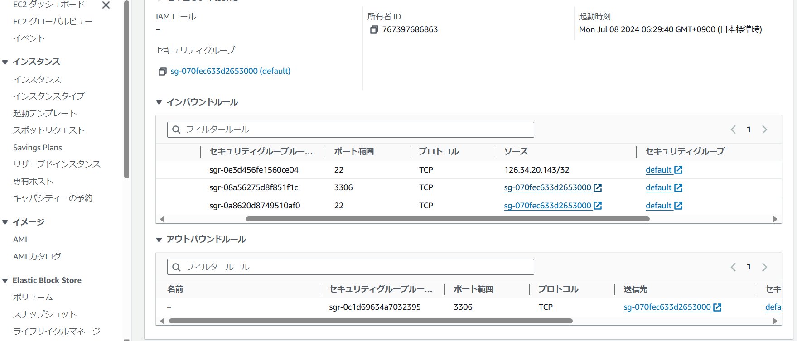
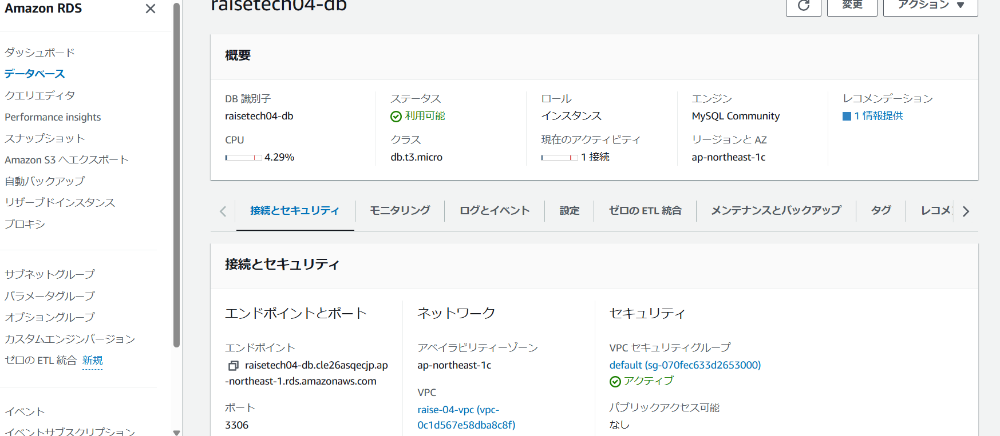
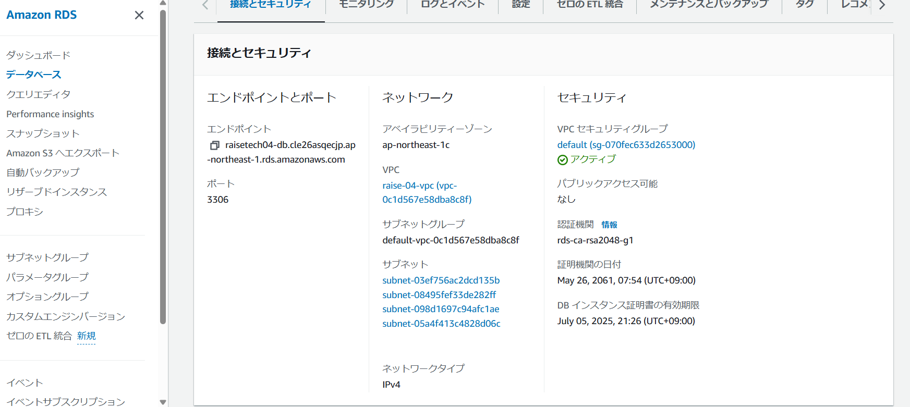
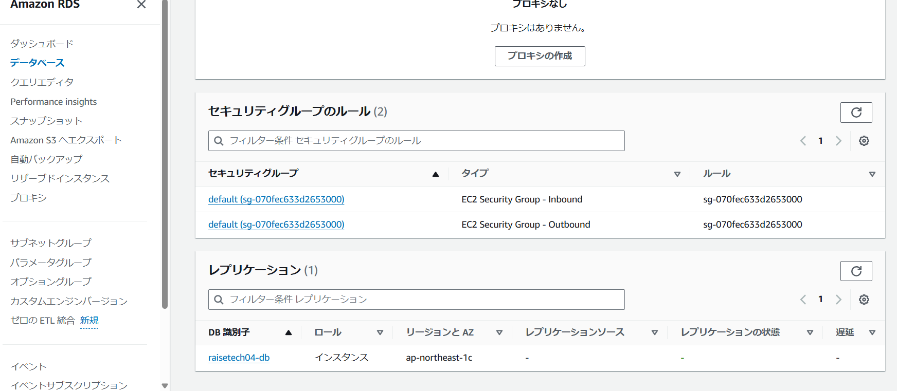
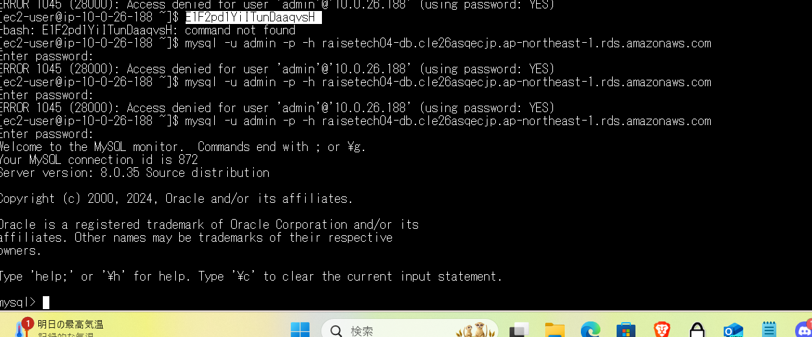

# 第４回の課題  

- VPCの作成  
  

- EC2の作成詳細、セキュリティー  
  
  

- RDSの作成、ルール、セキュリティー  
  
  
  

- EC2からRDS接続結果  
  

- 感想  
どこに何を作っているのかわからなくて、作っては壊すを何度も繰り返しました。パソコンってなんですか、から動画を視聴していて思っているよりもずっと時間がかかってしましました。
絵を書いていても、繋がりはIDなのでそれがどこに差してあるものなのかを理解しながら進めていくのがさらに難しかったです。