# 第五回の講義について  
  
  
* OS:Windows。ターミナルはTera Termを使用しています。  
  
## EC2へ環境構築  
1. 依存パッケージのインストール  
sudo yum update(install)  ｙで返答。  
2. パッケージ、ライブラリインストール  
sudo yum -y install gcc-c++ make patch git curl zlib-devel openssl-devel ImageMagick-devel readline-devel libcurl-devel libffi-devel libicu-devel libxml2-devel libxslt-devel  
3. Git Hubのインストール  
sudo yum install git -y  
git -v  
* サンプルアプリをクローンする。  
git clone　アプリのURL  
* README.mdのファイルをcatで参照。  
4.Node.jsインストール  
* AWSのリポジトリに追加。  
curl -sL https://rpm.nodesource.com/setup_14.x | sudo bash -  
sudo yum install nodejs
* nvm -vコマンドでインストールできているか確認。  
認識されなかったので、以下のコマンド実行。  
source ~/.bash-profile  
.bash-profile にnvmコマンドを認識させる。  
-v を実行して  
* バージョン指定でインストール。  
nvm install 17.9.1  
-vで確認。  
5. rbenv インストール  
git clone https://github.com/rbenv/rbenv.git ~/.rbenv  
* rbenv -v 認識されなかったので以下のコマンド実行。
echo 'export PATH="$HOME/.rbenv/bin:$PATH"' >> ~/.bash_profile  
* rbenvのコマンドが使えるように登録。  
echo 'eval "$(rbenv init -)"' >> ~/.bash_profile  
* シェルに定着するために、ログインシェルとして再起動。  
exec $SHELL -l  
* ruby-buildインストール。  
git clone https://github.com/sstephenson/ruby-build.git ~/.rbenv/plugins/ruby-build  
rbenvのプラグインとして動作する。  
rbenv rehash  
* インストールされたかの確認。  
rbenv -v  
6. Railsインストール  
gem install rails -v 7.1.3.2  
必要なバージョンを指定。  
rails -v
7. Bundlerインストール  
gem install bundler -v 2.3.14  
bundler -v  
8. yarn インストール  
yarn install  
* バージョンの指定。  
npm install --globalyarn@1.22.19  
yarn -v  
9. RDS(My SQL)インストール  
＊パッケージの更新。  
sudo yum update -y  
* mysqlのインストール。  
sudo yum install mysql  
* すでにクライアントがある場合、以下のRDSに接続。  
mysql -u admin -p -h データベースのエンドポイント  
* myspl クライアント開発ライブラリのインストール。  
sudo yum install -y mysql-devel  
* Ruby開発ヘッダのインストール。  
sudo yum install -y gcc ruby-devel  
* 特定バージョンのmysql2 gemをインストールする。  
gem install mysql2 -v '0.5.6'  
10. RDSへの接続  
* サンプルアプリに移動。  
cd raisetech-live8-sample-app  
bundle install  
* config/database.ymlファイルにて設定。  
username:<your_rds_username>  
password:<your_rds_password>  
host:<your_rds_endpoint>  
post:3306  
* Escの後、;wqにて保存。  
* サンプルアプリでデータベースを準備。  
bin/rails db:create db:migrate  
11. webpackとその依存関係のインストール  
yarn add webpack webpack-cli  
12. 組み込みサーバー(puma)でサンプルアプリを作動  
bin/setup  
bin/dev  
13. AWSサイトより、ec2についたセキュリティのインバウンドルール変更  
*ポート3000を追加。  
14. ブラウザからアクセス　　
http://IPアドレス:3000  
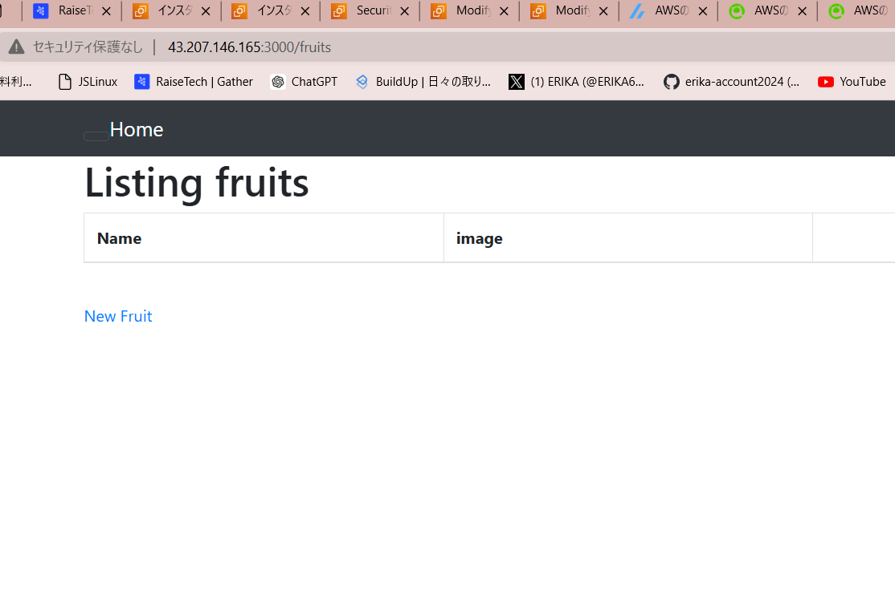  
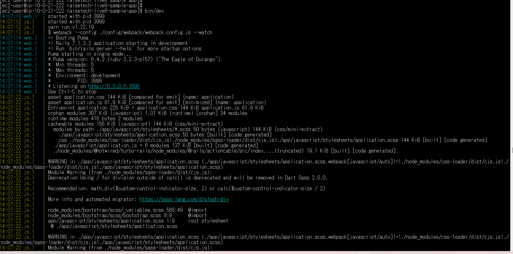  
      
## 画像表示ツールのインストール  
1. vips(ファイル)をインストール  
wget URL vips-8.15.3 tar.xz  
2.  凍結していて中身が機能しないので解凍  
tar -xf vips -8.15.3 tar-xz  
* ls で確認。　
3. 依存パッケージをインストール  
cd vips -8.15.3 に移動。  
* mesonインストール。  
sudo pip3 install meson  
* PATHに追加。  
export PATH=$PATH:/usr/local/bin  
meson -v
* ninjaインストール。  
buildをインストールしているけれどうまくパスが通らなかったので、手動でインストール。  
wget URL ~~~~~v1.11.1/ninja-linux.zip
* 解凍  
unzip ninja -linux.zip  
* libvipsライブラリを認識させる。  
sudo Id config  
* PATH に含まれたか確認。  
echo "/usr/local/lib64"| sudo tee /etc/Id.so.conf.d/vips.conf  
vips -v  
* webpack をインストールしていたので、mini_magickをインストールでもよかったのですね！！  
## 画像をTera Termに入れる  
1. ec2に接続  
2. Tera Termを使って画像ファイルをアップロード  
* Tera Termのウィンドウ上部メニューから"ファイル"を選択。  
* "SSH SCP"を選択。  
3. 画像ファイルをアップロードする  
* SCPのダイアログが開いたら、送信元の欄に"果物"の画像ファイルを指定。  
* ドラッグ＆ドロップ使用可能。  
* 宛先の欄には、ファイルを保存するec2上のパスを指定。  
(例)　/home/ec2-user/  
* "send送信"ボタンをクリックすると、ファイル画像がec2にアップロードされる。  
4. ファイルの確認  
* ls 実行。選択した画像の名前.OIP.jpgと表示されたらOK！  
5. 画像ファイルをサンプルアプリのpublicディレクトリーに移動  
mv /home/ec2-user/画像ファイル.OIP.jpg ~/raisetech-live8-sample-app/public/  
6. 写真内容を記述  
* ディレクトリーに移動。  
cd raisetech-live8-sample-app  
cd app/views/fruits  
* show.html.slimに追加内容記述。  
p  
 strong Additional Image:  
 =image_tag('fruit.IOP.jpg',alt:'Fruits')  
7. アセットパイプラインに画像ファイルを追加  
cp path/to/fruit.OIP.jpg/home/ec2-user/raisetech-live8-sample-app/app/assets/images  
* ls で確認  
8. ブラウザで確認。  
  
## 組み込みサーバーとUNIXsocketを使ってrailsアプリの動作確認  
* コンピュータ内で動作しているプログラム同士がデータをやり取りするための方法の一つ。今回はpumaとネットワークを接続させるために使用。  
1. サンプルアプリに移動  
cd raisetech-live8-sample-app  
2. config/puma.rbのファイルに設定を追加  
bind "unix:///home/ec2-user/raisetech-live8-sample-app/tmp/sockets/puma.sock"  
3. サーバを起動  
rails server --binding unix://bind "unix://raisetech-live8-sample-app/tmp/sockets/puma.sock"
4. puma起動  
bundle exec puma -C config/puma.rb  
* Lisning 3000  
5. ブラウザで確認  
http://IPアドレス:3000  
  
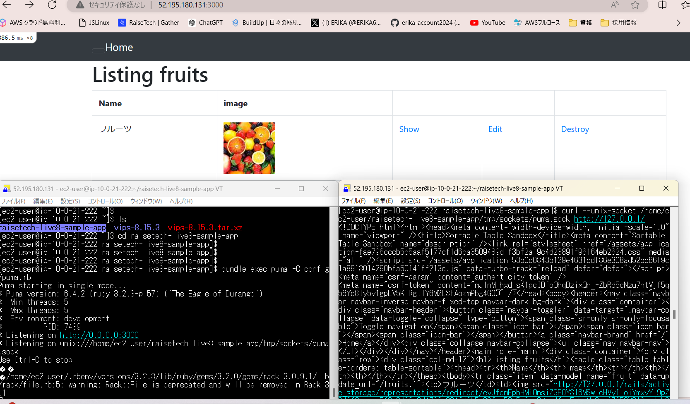   
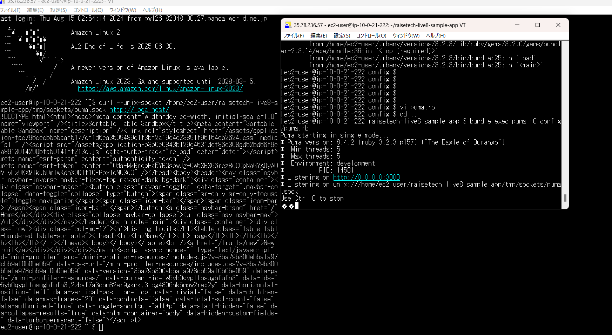  
  
## Nginx単体起動  
1. yumのアップデート  
sudo yum updete  
2. 追加のソフトウェアを管理する為のツールをインストール  
sudo yum install amazon-linux-extras  
3. Nginxのパッケージがあるかの確認  
amazon-linux-extras | grep "nginx"  
4. Nginxのインストール  
sudo yum clean metadata  
sudo yum install nginx  
5. Nginxの自動起動設定  
sudo systemctl enable nginx  
6. 起動する  
sudo systemctl start nginx  
* active(running)であること確認。
7. AWSよりec2セキュリティー編集  
* 追加：80ポート。  
8. ブラウザで確認  
http://IPアドレス  
  
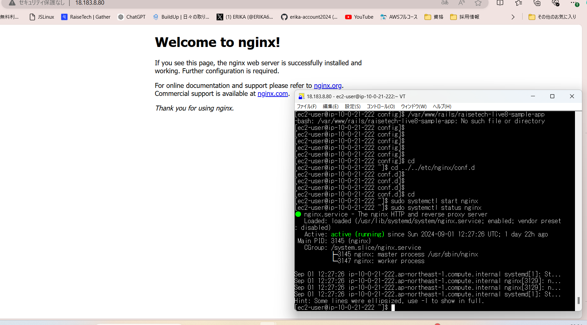   
  
## Nginxと組み込みサーバー、UNIXsocketを組み合わせてのアプリ作動  
1. Nginxの設定ファイルを編集  
* 設定ファイルにpumaとの連携を追加する。  
2. Nginxの設定ディレクトリーに移動  
cd /etc/nginx/conf.d  
3. vi nginx.conf.dにて編集  
user ec2-user

* upstream puma { 
    server unix:///home/ec2-user/raisetech-live8-sample-app/tmp/sockets/puma.sock;
}
    server {
        listen       80;
        #listen       [::]:80;
        server_name  ec2-3.112.82.117.ap-northeast-1.compute.amazonaws.com;

        access_log /var/log/nginx/access.log;
        error_log  /var/log/nginx/error.log;

        root         /home/ec2-user/raisetech-live8-sample-app/public;
       try_files $uri/index.html $uri @puma;

    location @puma {
        proxy_set_header X-Real-IP $remote_addr;
        proxy_set_header X-Forwarded-For $proxy_add_x_forwarded_for;
        proxy_set_header Host $http_host;
        proxy_pass http://puma;
   }  
  
4. 設定ファイルにエラーがないかを確認  
sudo nginx -t  
* エラー返答がなければOK！  
5. Nginxを再セット  
sudo systemctl restart nginx  
6. 起動  
sudo systemctl status nginx    
7. AWSよりec2セキュリティー編集  
*削除：3000  
8. ブラウザで確認  
http://IPアドレス  
  
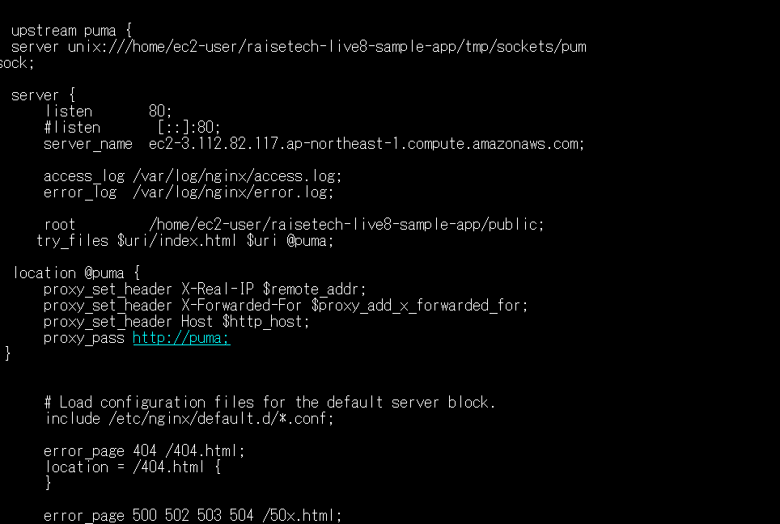  
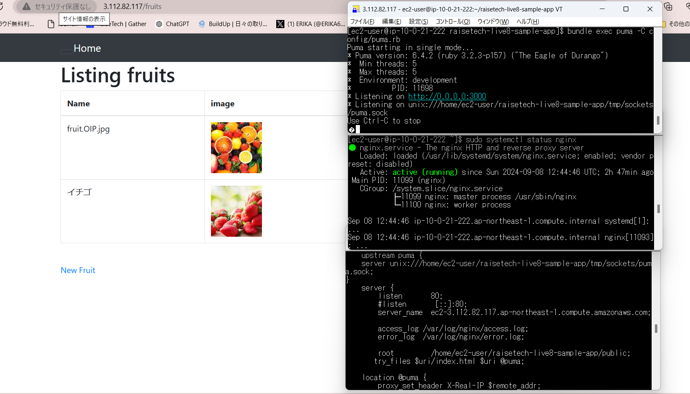  

  
## ALBを設置をしたうえでブラウザで確認
1. ターゲットグループの作成。
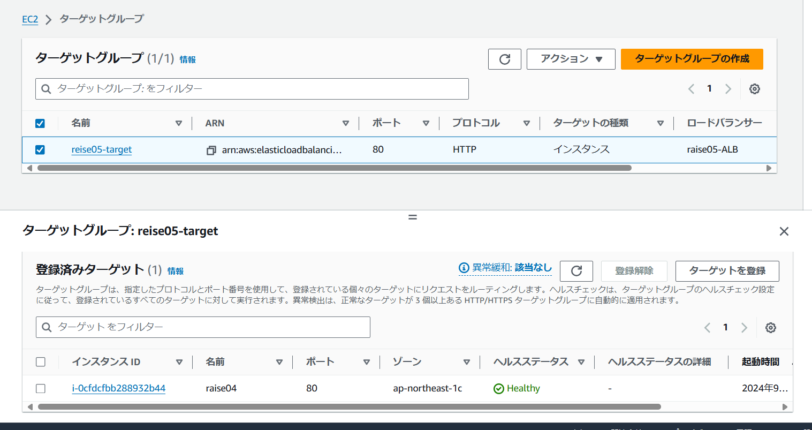
2. ALBの作成
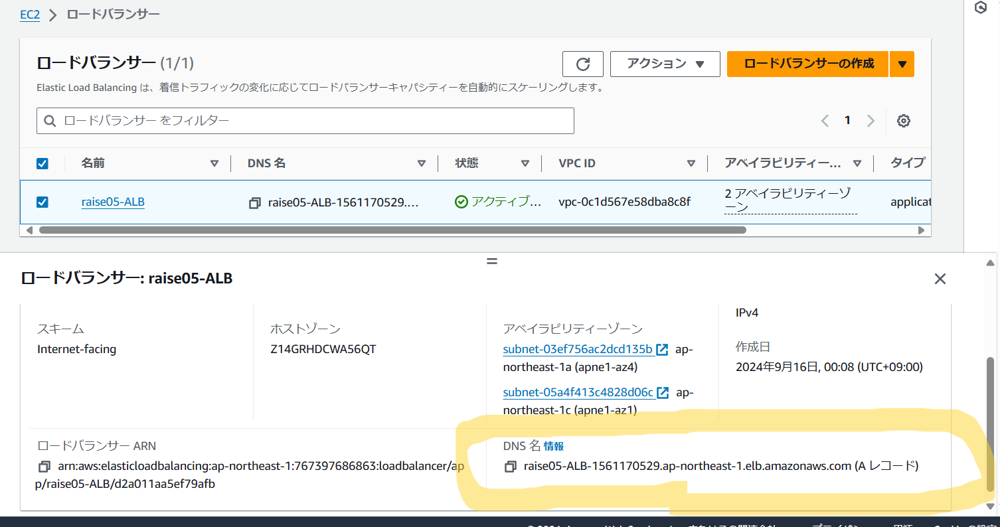
3. ALB用のセキュリティーグループ作成  
私のパソコン  
↓  
ALB(in:PCのIP)  
↓  
ec2(in:SSH;22;PCのIP,ALBセキュリティグループ;80;HTTP)  
↓  
RDS(in:EC2セキュリティーグループ;3306;MYSQL)  
4. ブラウザで確認  
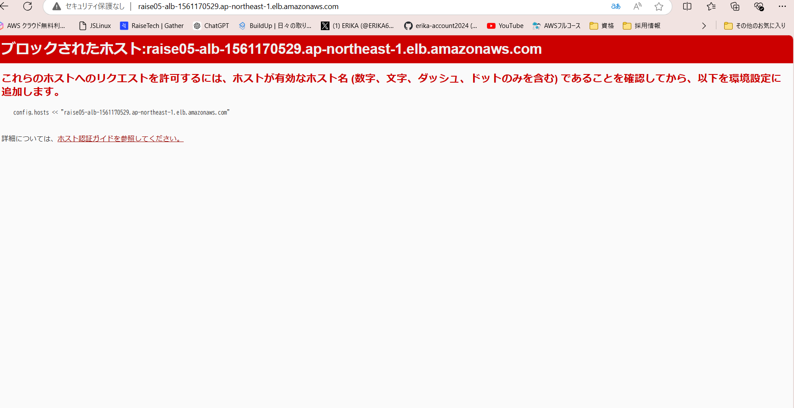  
5. configの内容を変更  
* etc/nginx/nginx.conf  
server_name ALBのドメインネーム  
* cd サンプルアプリ  
config/enviroments/development.rb  
config.host <<"ALBのドメインネーム"  
6. キャッシュの設定  
bin/rails dev:cache  
* 静的ファイルや一部の動的なコンテンツが保存され、次回以降のリクエストで再利用される。  
7. ブラウザで確認  
ALBドメインネーム  
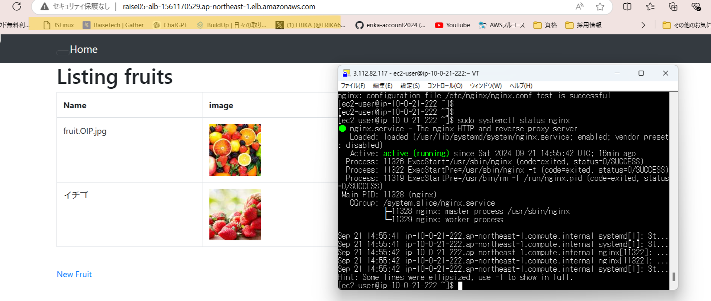  
8. 流れ  
8-1 ブラウザからALBにアクセス。  
8-2 ALBからNginxリクエスト転送。(server_nameがALBのドメインと一致しているためリクエスト処理してくれる)  
8-3 Nginxからpumaへリクエストを転送  
8-4 pumaがサンプルアプリにリクエストを渡す。(アプリはconfig.hostでALBのドメインを許可しているためリクエストを受け入れて処理)  
8-5 アプリがレスポンスを作成  
8-6 レスポンスをNginxが受け取り、ブラウザに渡す。  
  
# s3作成  
1. s3を作成して、バケットとリージョンを指定して作成。  
2. IAMロール作成。  
* このIAMをec2にアタッチする。  
3. ec2にログインして確認。  
aws s3 ls  
作成日付やバケット名  
4. セキュリティー保護  
* アクセスIDとシークレットアクセスキーを環境変数に変える。  
export AWS_ACCESS_KEY_ID=your_access_key_id  
export AWS_SECRET_ACCESS_KEY=your_secret_access_key  
source ~/. bashrc  
確認：echo $AWS_ACCESS_KEY_ID  
  
* Git Hub誤送信予防  
今回キーが見つからなかったので新しく作り直し。  
rm config/credentials/development.yml.enc  
EDITTOR=vi rails credentials:edit --environment development  
* gitignoreに追加  
echo "config/credentials/development.key">>.gitignore  
git add .gitignore  
git commit -m"Add devellopment.key to .gitignore"  
5. S3をアプリの中にセット  
cd アプリ/config/  
vi storage.ymlに以下を追加。  
amazon:s3  
bucket: <%=ENV['アクセスキーID']%>  
access_key_id: <%ENV['シークレットキー']%>  
  
config/environments/development.rbに追加。  
config.active.atorage.service:amazon  

# アップロードとダウンロード  
* ec2(loacal)から  
aws s3 cp アップロードしたいローカルのファイル名　s3://バケット名/フォルダ名/  
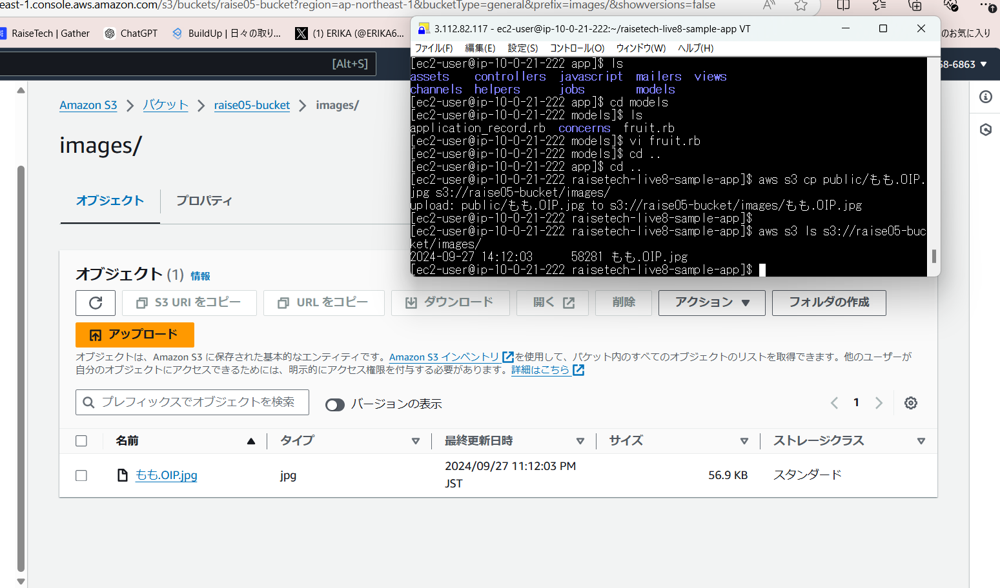  
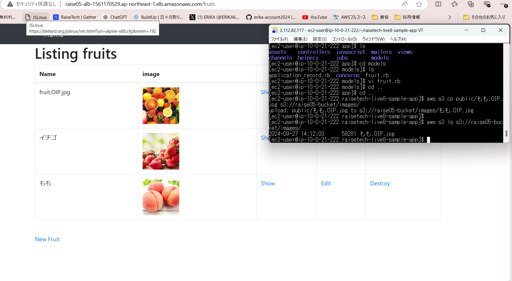  
* s3から  
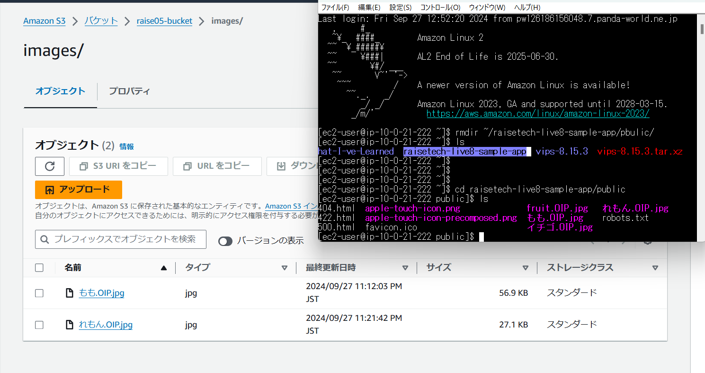  
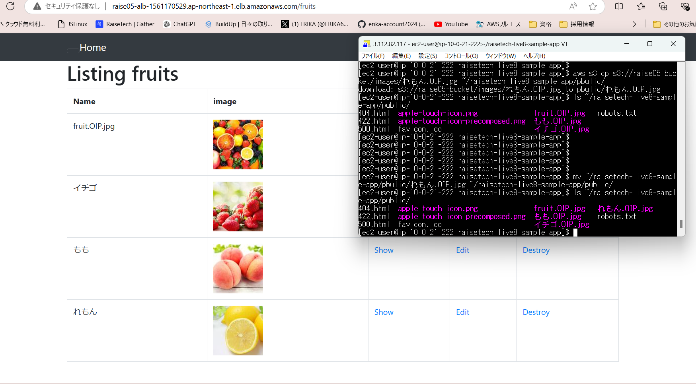  
※一部スペルミスやブラウザ不具合から異なる部分あり。  
  
# 構成図  
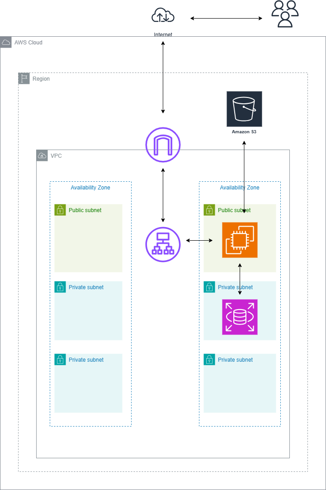  

# 感想  
難しさの中に楽しさもあり。わからないことを聞きながら、調べながら進めていく。➁か月強も費やした。  

