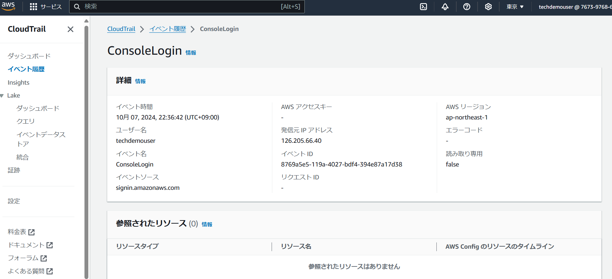
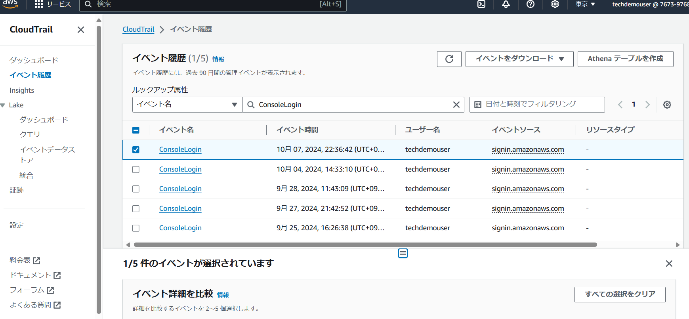
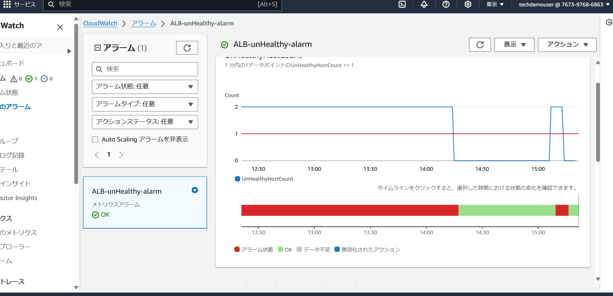
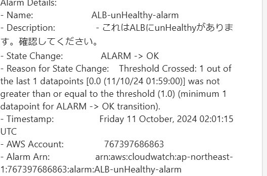
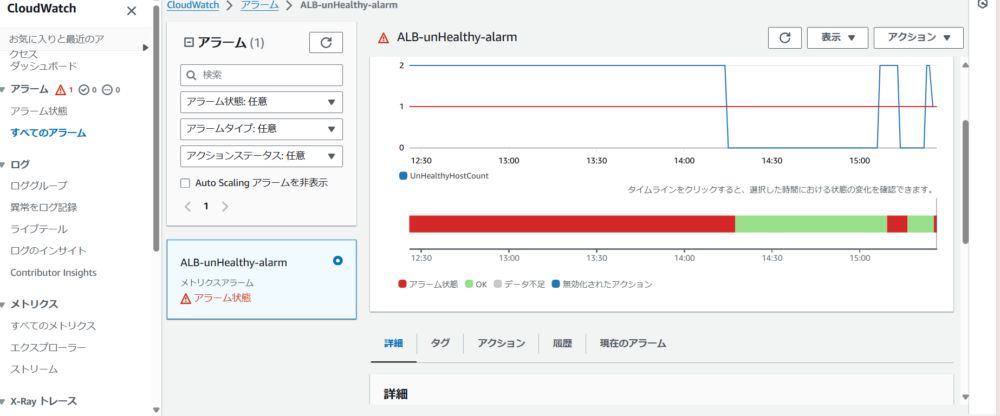
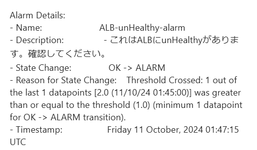
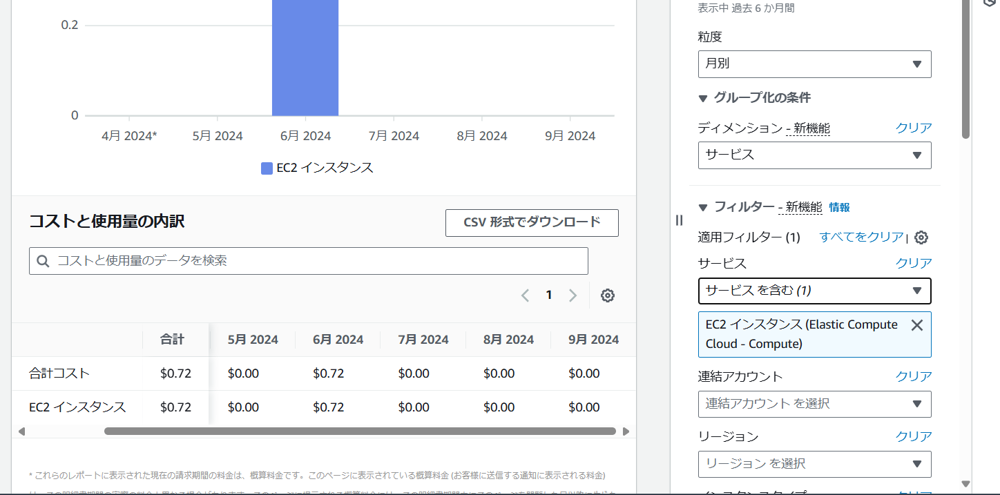
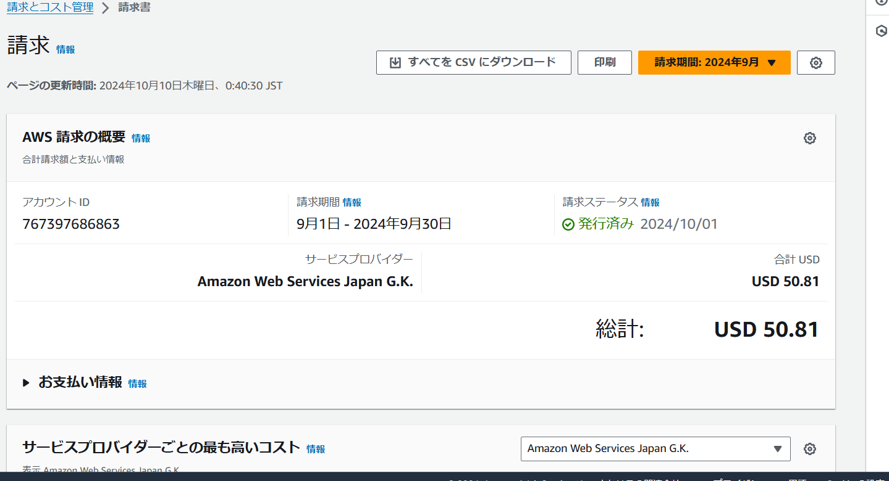
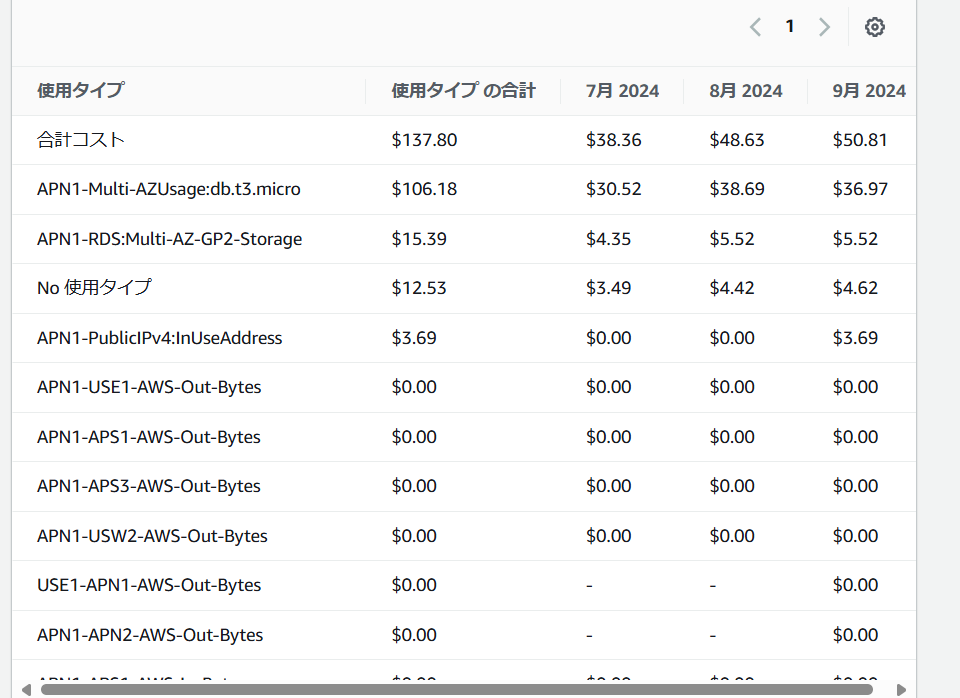

# 第６回課題  
  
## CloudTrailのイベント  
ConsoleLoginを確かめました。  
イベント履歴から検索できる。  
わかること：名前、ID 日付。  
  
  
  
## CloudWatchのALBアラーム  
アラームの作成。  
同一トピックから、正常、異常が検出できる。  
* Healthy
  
  
* unHealthy(異常) :ブラウザで確認できませんでした。
  
  
  
## 利用見積もり:第五回を想定。  
[見積もり料金はこちら](https://calculator.aws/#/estimate?id=fce50a32bfdca23fc90674baac34e96b42dc24c1)  
- EC2の料金  
  
- 先月の請求(９月分)  
  
  
  
  
* 請求が高くついてしまった理由:RDS作成時、無料枠ではないテストや開発環境を選択した様子で複数のアベイラビリティゾーンを所有した状態であった。  
* 解決方法:今回は削除してRDSを再作成しました。  
  
## 感想  
実際にきた請求と、今回の課題の内容とで見直すいい機会でした。  
  
  
  
## おまけ  
* pumaの自動起動。  
RDSを再作成したけれど、pumaを手動で動かさないとブラウザで表示されなかった為。  
  
1. " ~ "　から" etc"　へ。puama.serviceを作成する。  
````
$ cd /etc/systemd/system/
$sudo vi puma.service

````
````
[Unit]
Description=Puma HTTP Server
After=network.target

[Service]
Type=simple
User=ec2-user
WorkingDirectory=/home/ec2-user/raisetech-live8-sample-app
ExecStart=/home/ec2-user/.rbenv/shims/bundle exec puma -C /home/ec2-user/raisetech-live8-sample-app/config/puma.rb
Restart=always

[Install]
WantedBy=multi-user.target

````
2.systemdを新しいサービスと認識させる。  

````
$ sudo systemctl daemon-reload

````
3. pumaのサービスを起動する。  

````
sudo systemctl start puma

````
4. サーバー起動時にpumaが自動的に起動するように設定。  

````
sudo systemctl enable puma

````
  

  


