# 第１０回 Cloudformation スタック作成  
  
- [TemplateFormat10.yml](/Templates10/TemplateFormat10.yml)
- [参考にしたURL](https://techblog.nhn-techorus.com/archives/24028)  

## 今回の構成図:01.24に変更しました。  
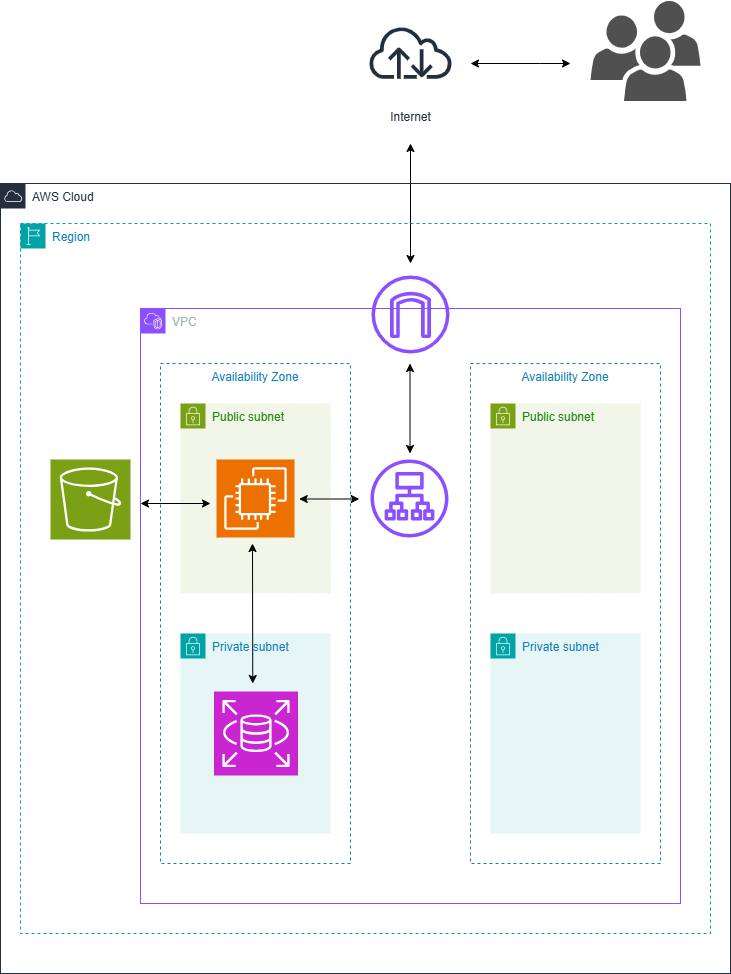
    
## 結果
  
### スタック作成の結果  
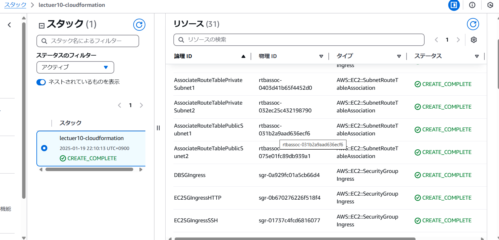 

### VPC  
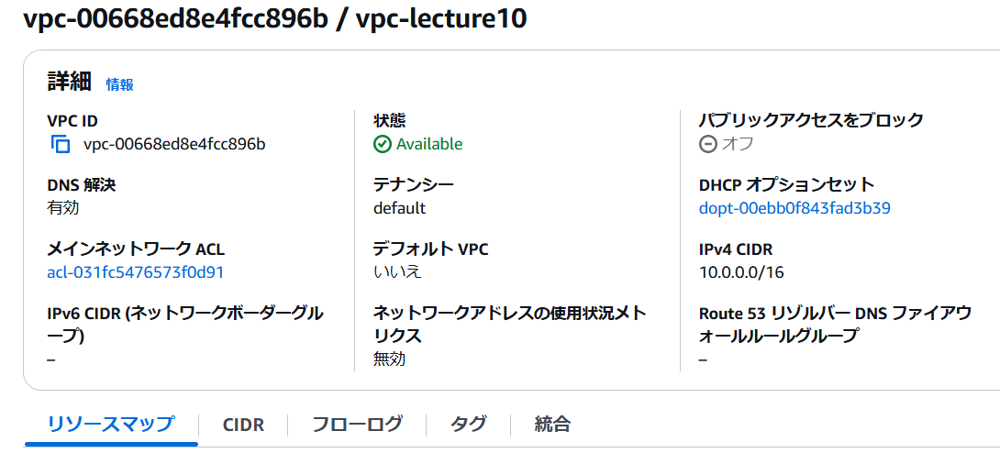  
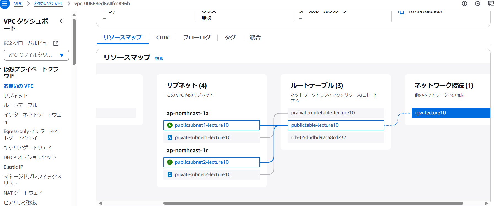  
  
### Route Teble  
- publicID
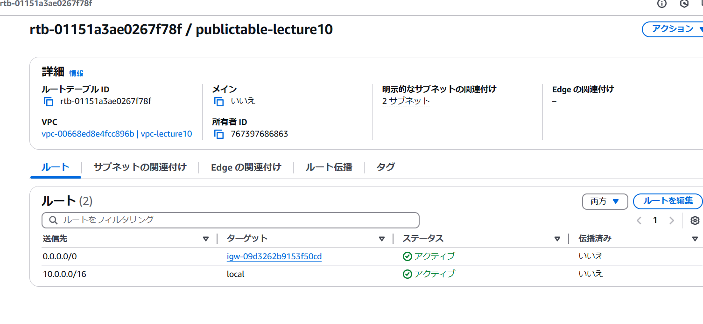  
- praivateID
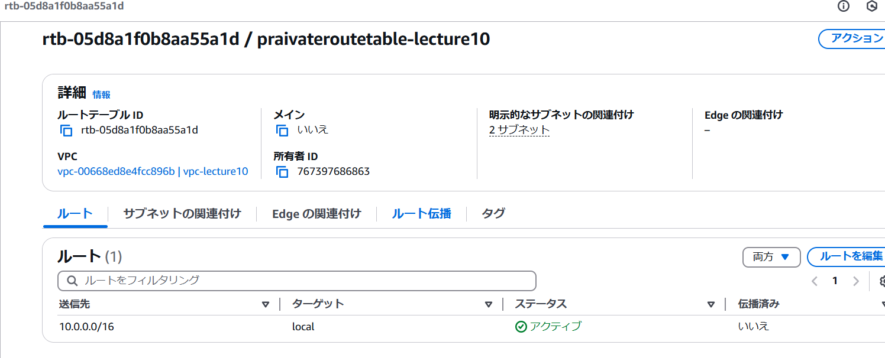  
  
### Target Group  
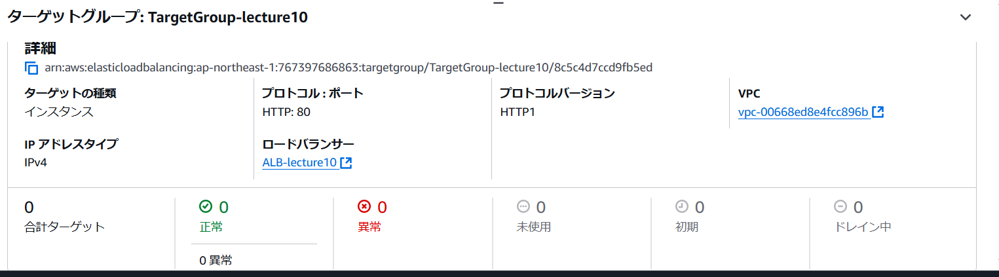  
  
### ALB  
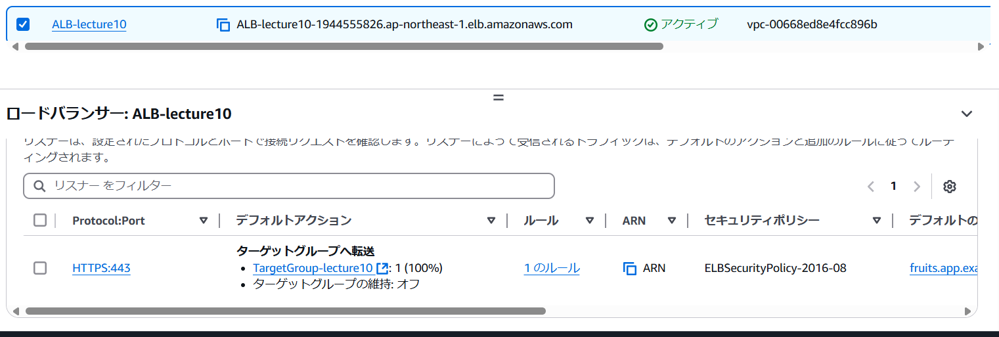  
  
### InternetGateway
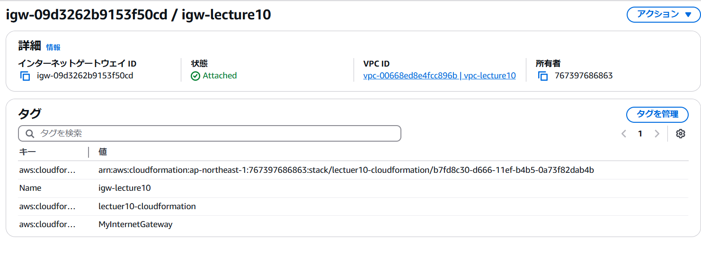  
  
### EC2  
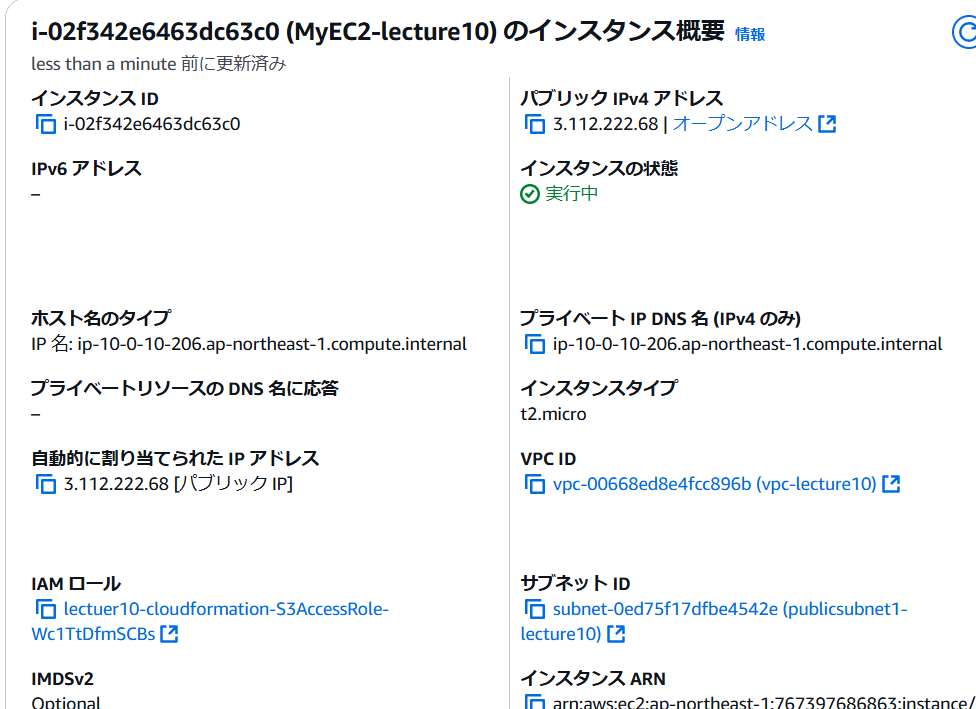  
  
### securityGroup  
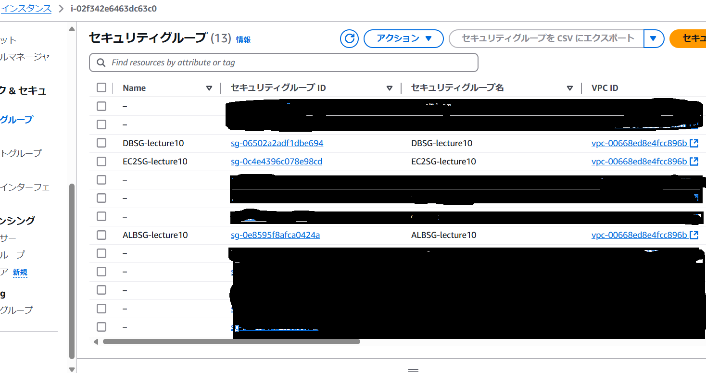  
  
### RDS  
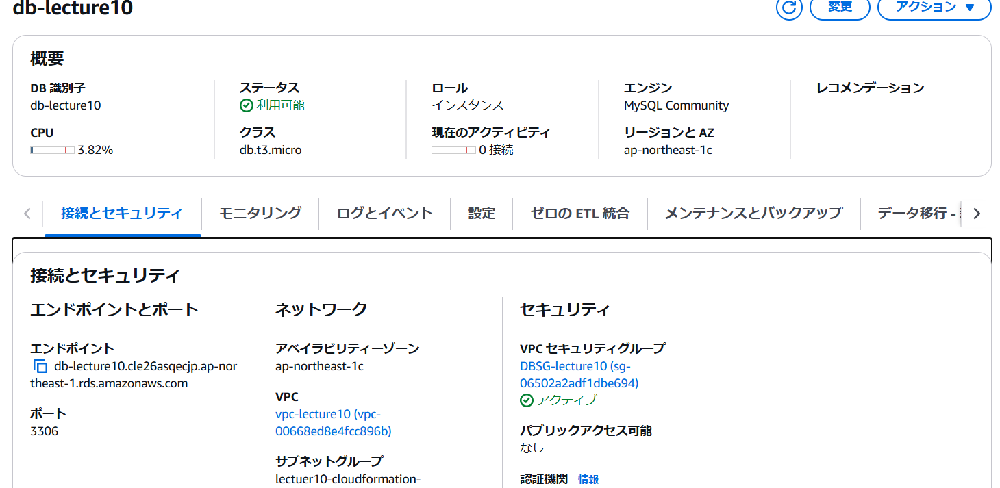  
  
### EC2へ接続  
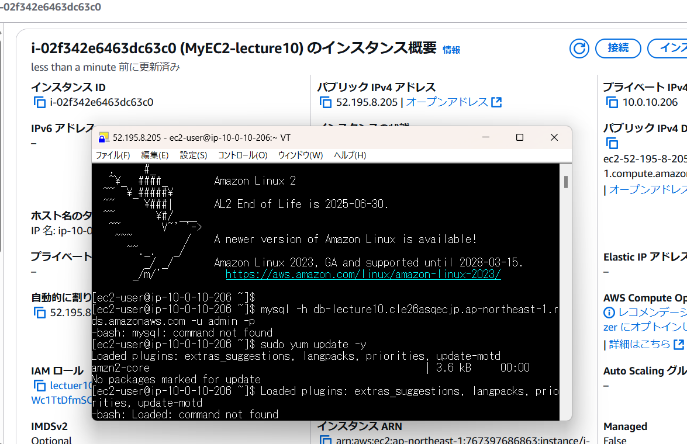  
  
### RDSへ接続  
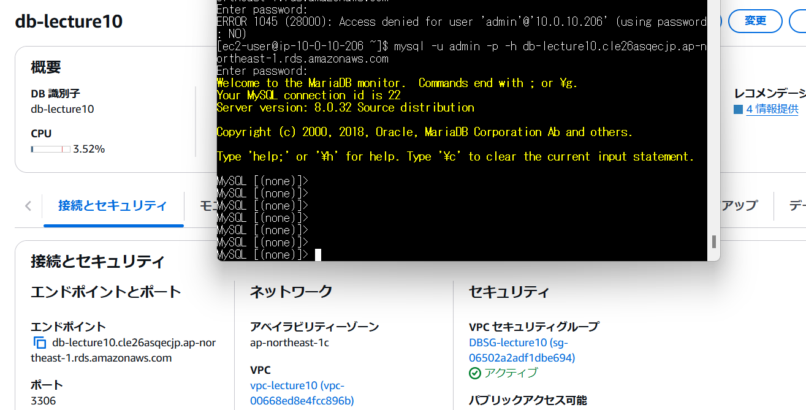  
  
## 感想  
第４回で作成した内容を文字おこしで作成して、何を書いているのか、どうやって作成するのかもわからなかった。慣れて、楽しく思う頃には、エラーと格闘していました。作り直しについて、書かれて構文を手直しするだけでいいのでとても簡単で、時間もかからない素敵なサービスだと認識できました。

 
